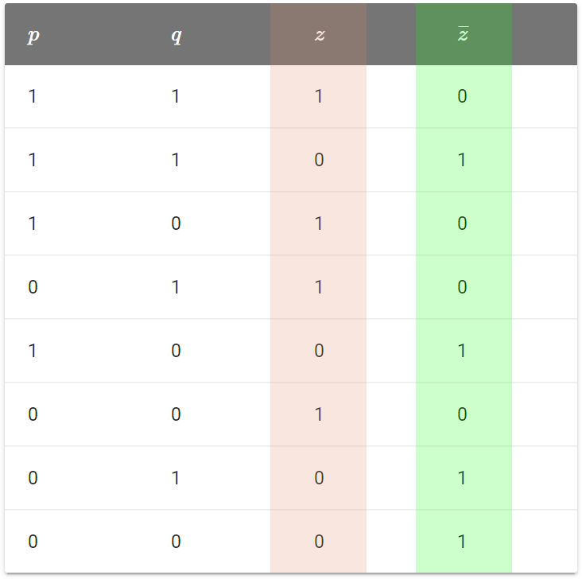
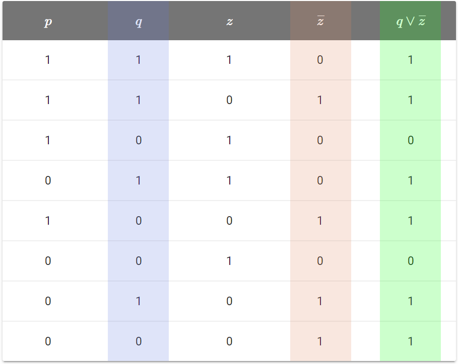
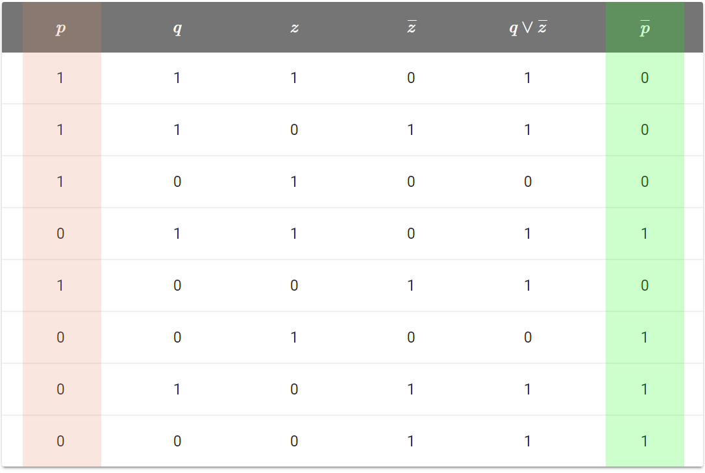
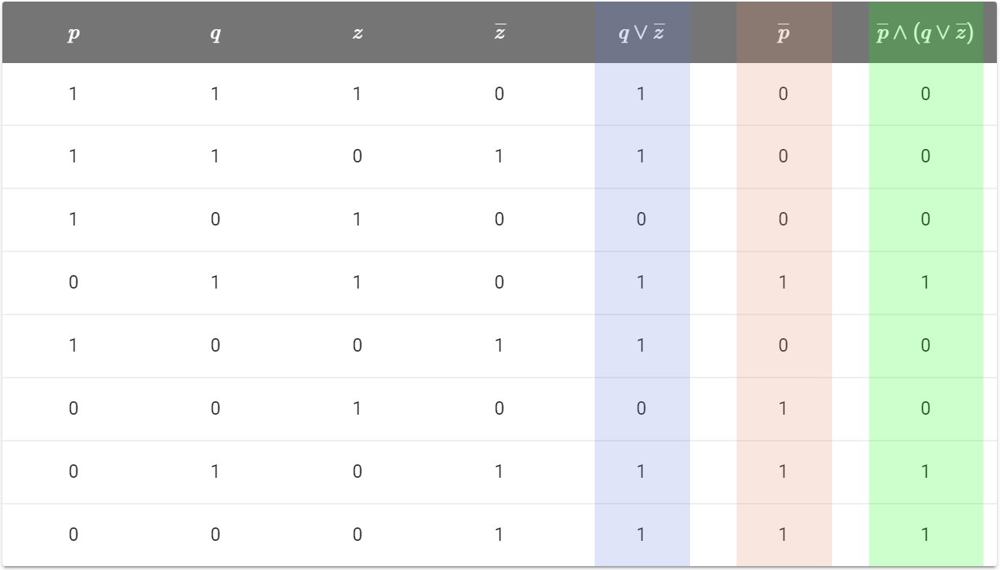

# Логические операции

В предыдущей статья мы выяснили, что язык математической логики позволяет нам удобно записывать рассуждения.
Когда мы рассуждаем, мы из одних выражений получаем другие. Но каким образом?

Чаще всего, новые высказывания получают на основе имеющихся с помощью логических операций.

{: #def-logic-operation-base }

!!! определение
    **Логическая операция** — операция над одним и более высказываниями в результате которой также получаем высказывание.

Какие существуют логические операции?

Надо просто посмотреть, как мы преобразуем высказывания в повседневной жизни и ввести аналогичные действия в математическую логику.

Поехали!

## Отрицание $ \neg $

В русском языке мы очень часто используем выражения типа:

* "Не"
* "Неверно, что"

Мы используем их, когда что-то отрицаем.

Например, если мы хотим отрицать высказывание "$5 + 5$ равно $10$", то говорим "$5 + 5$ **не** равно $10$" или "**Неверно, что** $5 + 5$ равно $10$".

Но "$5+5$ равно $10$" — истинное высказывание, поэтому его отрицание — ложь. Получается, из отрицания истинного высказывания получаем ложное.

Рассмотрим теперь высказывание "любой квадрат это круг". Очевидно, что это ложное высказывание. Его отрицанием будет выражение "любой квадрат это **не** круг".
Несложно догадаться, что это истинное высказывание. Получается, что из отрицания ложного высказывания получаем истинное.

Мы рассмотрели обычный, житейский смысл отрицания. Теперь выразим его в виде логической операции.

{: #def-logic-negation }

!!! определение
    **Отрицание**  (*логическое НЕ*) — логическая операция над высказыванием $p$, результат которой истинный, когда $p$ ложно и ложный, когда $p$ истинно.

Обозначается отрицание знаком $ \neg $ перед или чертой над высказыванием:

\begin{align\*}
    \neg p && \overline{p}
\end{align\*}

Для более наглядного представления результатов логических операций пользуются **таблицей истинности**:

| $p$ | $\overline{p}$ |
|---|---|
| 0 | 1 |
| 1 | 0 |

Как видно, в таблице сначала идут все возможные значения $p$ ($0$ и $1$), а затем результат операции отрицания для данных значений.

## Конъюнкция $ \land $

Выступим в роле строгой мамы и пообещаем сыну поездку в кину, если он "сделает уроки **и** сходит в магазин". Ключевую роль здесь играет союз **И**.

Он объединяет два простых высказывания:

* $p = $ "Сын сделал уроки"
* $q = $ "Сын сходил в магазин"

в одно сложное.

Очевидно, что сын поедет в кино только если он сделал уроки ($p = 1$) **и** сходил в магазин ($q = 1$). В любом другом случае поездка в кино не состоится.

Другой пример. Рассмотрим истинность высказывания "Число 2 простое, **и** число 2 четное". Оно истинно, так как истинны оба составляющих его высказывания:

* "Число 2 простое"
* "Число 2 четное"

Итак, мы выяснили житейский смысл союза **и**. Вводим новую логическую операцию!

{: #def-logic-and }

!!! определение
    **Конъюнкция** (*логическое И*, *логическое умножение*) — логическая операция над двумя высказываниями $p$ и $q$, результат которой истинный тогда и только тогда, когда $p$ и $q$ истинны.

Обозначается конъюнкция знаком $\land$, точкой $\cdot$, а иногда и вовсе без знака:

\begin{align\*}
    p \land q && p\cdot q && pq
\end{align\*}

Таблица истинности конъюнкции выглядит так:

| $p$ | $q$ | $p\land q$ |
|---|---|---|
| 1 | 1 |1|
| 0 | 1 |0|
| 1 | 0 |0|
| 0 | 0 |0|

В этой таблице для каждого набора значений $p$ и $q$ (всего четыре) задается значение конъюнкции.

Именно на таблице видно, почему конъюнкцию иногда называют умножением и используют точку вместо $\land$. Если перемножать значения из первых двух колонок для каждой строки, получим правильные значения в третьей колонке.

## Дизъюнкция $\lor$

Начнем с примера из жизни. Всем нужны деньги. Чем больше денег, чем лучше, так? (Нет)
Получается, получить много денег можно, если "честно работать **или** ограбить банк".

Как и с конъюнкцией, ключевую роль здесь играет союз **ИЛИ**.

Он объединяет два простых высказывания:

* Я честно работал
* Я ограбил банк

в одно сложное.

Чтобы получить много денег, достаточно выполнить хотя бы одно из этих простых высказываний. Но ничего страшного, если мы выполним и оба. Тогда денег будет еще больше. Заметьте, разницу с конъюнкцией. Она требует, чтобы
оба простых высказывания были истинными. В нашем же примере с союзом **или**, достаточно, чтобы хотя бы одно из высказываний было истинным.

Ну и очевидно, что если мы не работали и не ограбили банк, то денег много не будет.

Другой пример — высказывание "Число 3 четное **или** число 3 простое", состоящее из простых высказываний:

* $ p = $ "Число 3 четное"
* $ q = $ "Число 3 простое"

Очевидно, что $ p = 0 $ (ложь, так как 3 — нечетное число) и $ q = 1 $ (правда, так как оно простое).

Союз "и" требовал истинности обоих высказываний, а вот "или" достаточно
истинности только одного. Другими словами, союзом "или" в обычной жизни мы даем понять, что готовы закрыть глаза на то, что какая-та часть нашего высказывания может оказаться ложной.

Получается, что высказывание "Число 3 четное **или** число 3 простое" истинное, так как одно из его составных высказываний истинно.

Итак, мы выяснили смысл союза **или**. Определим теперь его аналог в математической логике:

{: #def-logic-or }

!!! определение
    **Дизъюнкция** (*логическое ИЛИ*, *логическое сложение*) — логическая операция над двумя высказываниями $p$ и $q$, результат которой истинный тогда и только тогда, когда истинно хотя бы одно из них.

Обозначается дизъюнкция знаком $\lor$ или обычным плюсом $+$:

\begin{align\*}
    p \lor q && p + q
\end{align\*}

Таблица истинности дизъюнкции выглядит так:

| $p$ | $q$ | $p\lor q$ |
|---|---|---|
| 1 | 1 |1|
| 0 | 1 |1|
| 1 | 0 |1|
| 0 | 0 |0|

Отчетливо видно, что дизъюнкция ложна только в одном случае — когда ложны оба составляющих ее высказывания.

Легко увидеть, почему дизъюнкцию иногда называют (логическим) сложением.
Если складывать значения из первых двух колонок для каждой строки, будем получить правильные значения третьей колонки. В первой строке результат сложения получится $2$, но тут надо помнить, что
у нас не обычное сложение, а **логическое**, поэтому $1 + 1 = 1$.

## Строгая дизъюнкция $ \oplus $

В предыдущем разделе мы рассматривали союз "или" в соединительном смысле. Однако, его можно использовать по-другому.

Рассмотрим высказывание: "Я стану или физиком, или математиком". Как и в случае с обычной дизъюнкцией, это высказывание будет истинным, когда одно из составных высказываний истинно.

Но есть один ключевой нюанс. Если оба составных высказываний истинны, то результат получаем **ложный**, потому что житейский смысл этого высказывания: "стать либо только физиком, либо только математиком". И тем и другим стать нельзя.

{: #def-logic-xor }

!!! определение
    **Строгая дизъюнкция** — логическая операция над двумя высказываниями $p$ и $q$, результат которой истинный тогда и только тогда, когда истинно только одно из них.

Обозначается дизъюнкция знаком $\oplus$:

\begin{align\*}
    p \oplus q
\end{align\*}

Таблица истинности строгой дизъюнкции:

| $p$ | $q$ | $p\oplus q$ |
|---|---|---|
| 1 | 1 |0|
| 0 | 1 |1|
| 1 | 0 |1|
| 0 | 0 |0|

Видно, что ложность результата при истинных составных высказываниях — единственное отличие строгой дизъюнкиции от обычной.

## Немного практики

Итак, мы уже знакомы с 4 самыми базовыми логическими операциями. Так как эти операции — аналоги наших рассуждений в голове, навык работы с должен прочно засесть у вас в голове! В перспективе, любые ваши мысли, догадки и гипотезы о математике должны сразу возникать в голове с использованием этих операций.

Рассмотрим пример. Пусть нам даны произвольные высказывания $p$, $q$ и $z$. Из них в словесной форме составили высказывание: "Не $p$ и ($q$ или не $z$)".

Последовательно заменяя "словесные операции" на логические, записываем это высказывание на языке математической логики:

$$ \overline{p} \land (q \lor \overline{z}) $$

!!! упражнение
    Пусть: $p = $ "Петя сходил в кино", $q = $ "Петя не купил хлеб", $z = $ "Петя помыл посуду".

    Запишите на языке математической логики высказывание "Неверно, что Петя сходил в кино и или не купил хлеб, или не помыл посуду", используя высказывания $p, q, z$.
    
    ??? ответ
        $$ \overline{ p \land (q \oplus \overline{z}) } $$

Теперь научимся проверять истинность высказываний. Пусть дано следующее высказывание:

$$ \overline{p} \land (q \lor \overline{z}) $$

Как проверить его на истинность? Самый надежный способ — построить таблицу истинности для него. Начнем с перечисления всех возможных комбинаций значений исходных высказываний $p, q$ и $z$:

|$p$|$q$|$z$|
|:-:|:-:|:-:|
|1|1|1|
|1|1|0|
|1|0|1|
|0|1|1|
|1|0|0|
|0|0|1|
|0|1|0|
|0|0|0|

Дальше рассмотрим высказывание в скобках:

$$ (q\lor \overline{z}) $$

Оно состоит из $q$ и $\overline{z}$. Для $q$ в нашей таблице уже есть колонка. А для $\overline{z}$ — нет.
Для построения этой колонки достаточно смотреть на колонку $z$ (выделена оранжевым), для каждого ее значения брать отрицание и записывать в колонку $\overline{z}$ (выделена зеленым):

[{: .w7}](images/complex-truth-table-step-1.png)

Теперь у нас есть колонки для $q$ и $\overline{z}$, а значит, можно добавить колонку $q\lor\overline{z}$. И снова, смотрим на колонки $q$ (выделена синим) и $\overline{z}$ (выделена красным) и
записываем значение дизъюнкции в отдельную колонку (выделена зеленым):

[{: .w7}](images/complex-truth-table-step-2.png)

Изначальное высказывание имеет вид:

$$ \overline{p} \land (q \lor \overline{z}) $$

У нас нет колонки для $\overline{p}$. Получить ее можно так же, как мы получили $\overline{q}$ — берем каждое значение из $p$ и записываем его отрицание в отдельную колонку.

[{: .w8}](images/complex-truth-table-step-3.png)

Итак, теперь у нас есть колонки $\overline{p}$ и $q\lor\overline{z}$. Осталось добавить последнюю колонку к нашей таблице. Эта колонка и будет содержать результат (правда или ложь) исходного высказывания,
в зависимости от значений исходных высказываний.

Смотрим на колонки $\overline{p}$ (красная) и $q\lor\overline{z}$ (синяя) и записываем значение конъюнкции в последнюю колонку таблицы:

Вот и все. Можно убрать промежуточные колонки и оставить только первые три (комбинации значений) и послднюю (результат высказывания).

Итак, таблица истинности для высказывания:

$$ \overline{p} \land (q \lor \overline{z}) $$

выглядит так:

|$p$|$q$|$z$|$\overline{p} \land (q \lor \overline{z})$|
|:-:|:-:|:-:|:-:|
|1|1|1|0|
|1|1|0|0|
|1|0|1|0|
|0|1|1|1|
|1|0|0|0|
|0|0|1|0|
|0|1|0|1|
|0|0|0|1|

## Почему это работает?

## Промежуточный итог

В этой статье мы ввели и освоили самые простые и очевидные логические операции:

* Отрицание
* Конъюнкция
* Дизъюнкция
* Строгая дизъюнкция

В следующих двух статьях мы разберем еще две логические операции: импликацию и эквивалентность.

Почему в отдельных статьях? Потому что они сложнее для понимания и в то же время играют огромную роль во всех разделах математики.
На каждую из них будет лучше выделить отдельную статью с большим количеством примеров и пояснениями.