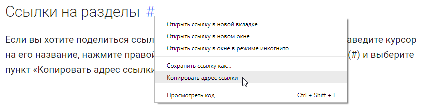
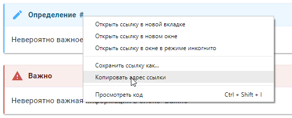

description: Понятный, подробный и интересный учебник по математике, который дополняется и поддерживается сообществом! Присоединяйтесь!

# Об учебнике

* Никак не получается решить задачу?
* Мучает вопрос "Почему так?" во время прохождения любой темы?
* Школьный учебник слишком скучный/сложный?
* Хотите научится понимать и использовать математику?

Тогда вы по адресу.

Добро пожаловать на понятный, подробный и интересный учебник по математике, который дополняется и поддерживается **сообществом**, а не
**единственным** автором!

Цели учебника:

* Просто, но глубоко и систематично объяснить математику начиная с самых основ
* Научить применять математику для решения реальных задач
* Создать площадку для ответов на вопросы, дискуссий и обмена опытом

## Порог вхождения

Для прохождения первых разделов учебника требуются только самые элементарные школьные знания: числа
и действия с ними, минимальные познания в геометрии и так далее. Весь последующий материал учебника базируется
**строго** на предыдущих уже пройденных разделах. Никаких скачков, логических пропусков, "примите это на веру" и тому подобных вещей!

Как правило, к каждому новому понятию/теореме приводится не один, а целый ряд примеров из разных разделов математики.
То есть, если не разобрались с геометрическим примером, разберетесь с алгебраическим.

## Блоки

Часто в тексте будут встречаться блоки. Всего есть 4 основных типа блоков:

{: #def-example }

!!! определение
    В таких блоках вводятся определения. Все определения нужно знать наизусть или хотя бы уметь объяснить их своими словами.
    
{: #theorem-example }
    
!!! теорема
    В этих блоках расположены формулировки теорем. Как правило, под блоком теоремы сразу приводится ее доказательство.
    Форумлировки теорем, как и определения, надо знать наизусть.
    Доказательства учить не нужно.
    
!!! важно
    Эти блоки обращают ваше внимание на моменты, которые часто приводят к ошибкам и недопониманиям.
    
!!! упражнение
    В таких блоках приведен текст упражнения. Для глубокого усвоения материала нужно решить
    все упражнения (хотя бы попытаться). Время решения каждого упражнения — не более 10-15 минут. Если не получается, смело открывайте указание.
    
    ??? указание
        Если у вас долго не получается решить упражнение, можете заглянуть в этот блок. Здесь приведены
        подсказки к решению. Указания есть у большинства упражнений.
    
    ??? ответ
        В этом блоке содержится ответ на вопрос или алгоритм решения задачи вместе с финальным ответом.
        
## Ссылки на разделы

Если вы хотите поделиться ссылкой на какой-то раздел учебника, просто наведите курсор на его название, нажмите
правой кнопкой на появившемся значке ссылки (#) и выберите пункт «Копировать адрес ссылки».

{: .img-border }

Можно ссылаться и на определения с теоремами. Для этого нужно также навести курсор мыши на их названия и скопировать ссылку:

{: .img-border }

## Исправление ошибок

Если вы заметили неточность или ашибку в тексте, то есть два варианта:

* Оставить сообщение в соответствующей теме на форуме
* Самостоятельно исправить ошибку через GitHub. В этом случае вы будете отображаться в списке "Вклад внесли"