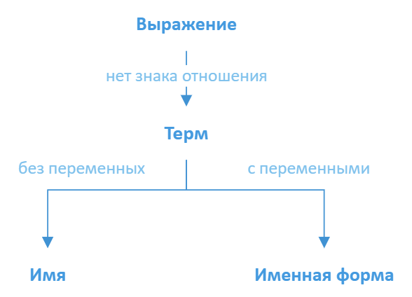
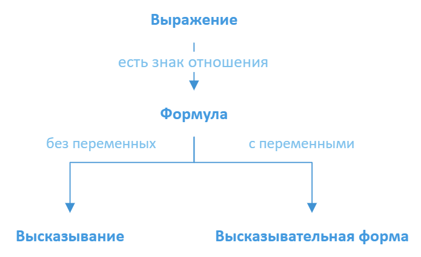
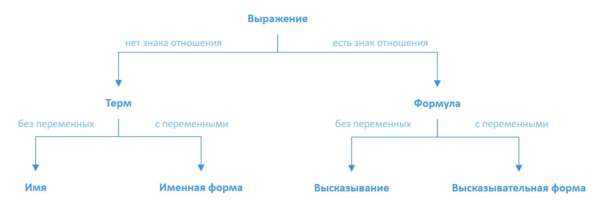

# Выражения

В прошлой статье мы составили базовый алфавит математики. Буквы этого алфавита можно комбинировать, получая **слова**.

{: #def-word }

!!! определение
    **Слово** — конечная последовательность букв алфавита.
    
Примеры слов:

$$ 2 + 2 = 4 \\\\ x2 = (9+) \\\\ a\cdot 4(\div $$

Как видно из последних двух примеров, слова не обязательно должны быть осмысленными. Случайный набор букв тоже считается словом.
Получается, что все слова языка математики можно поделить на бессмысленные и осмысленные. Слова, имеющие смысл будем называть
**выражениями**.

{: #def-expression }

!!! определение
    **Выражение** — слово в языке математики, которое имеет смысл.

Отлично. Теперь у нас есть название для осмысленных слов (выражения). Но в математике очень много самых разных выражений:

$$ 13025 \\\\ 2 + 3 \\\\ x - 2 = 4 \\\\ (9 + x) \cdot y < z $$

Нужно построить классификацию выражений в математике.

## Термы

Начнем с выражений, которые не содержат знака отношения (\\( = \\) и \\( < \\)).

Во-первых, мы можем составлять числа из цифр:

\begin{align}\notag
    7 && 89 && 1224
\end{align}

Во-вторых, можно записывать выражения с операциями, но без переменных/постоянных:

\begin{align}\notag
    2 + 3 && (9 - 1) \cdot 5 && (7 - 2) \cdot (89 + 4)
\end{align}

Наконец, существуют выражения и с операциями, и с переменными/постоянными:

\begin{align}\notag
    x - 4 && 8x + 2y - c && (a + b)\cdot(a - b)
\end{align}

Вроде все. Больше никаких типов выражений с имеющимися буквами алфавита (без знаков отношений) придумать не получается.
Назовем все такие выражения **термами**.

Попробуем составить правила, по которым можно конструировать термы:

{: #def-term }

!!! определение
    1) Каждая отдельная цифра или буква латинского алфавита — **терм**. Такие термы называются элементарными.
    
    2) Если \\(T_1\\) и \\(T_2\\) — термы, то \\( (T_1 + T_2) \\) и \\( (T_1\cdot T_2) \\) также термы.
    
    3) Других термов, кроме тех, которые могут быть получены с помощью 1) или 2), нет.

Определение выше отличается от определений в предыдущих статьях.

* Сначала мы задаем элементарные термы (цифры и буквы латинского алфавита)
* Потом задаем правило, как из этих элементарных термов получить все остальные (через сложение и произведение)
* В конце заявляем, что других термов, кроме элементарных и полученных по правилу, не существует

Такие определения называются **индуктивными**. Чем они удобны? А тем, что с их помощью можно взять любое
слово в языке математике и выяснить, является ли оно термом или нет.

Пример:

$$ (((3+a) \cdot 2) + (3 \cdot x)) $$

1. \\(3\\) — терм (пункт 1 определения)
2. \\(a\\) — терм (п.1)
3. \\( (3+a) \\) — терм (из 1,2 по п.2)
4. \\(2\\) — терм (п.1)
5. $ ((3+a)\cdot 2) $ — терм (из 3,4 по п.2)
6. $ x $ — терм (по п.1)
7. $ (3\cdot x) $ — терм (из 1,6 по п.2)
8. $ (((3+a)\cdot 2) + (3\cdot x)) $ — терм (из 5,7 по п.2)

Разберем теперь вот это слово:

$$ a\cdot 4 (\div $$

1. $ a $ — терм (п.1)
2. $ 4(\div $ — не терм, потому что скобка и знак деления не входят в допустимые для элементраных термов буквы
3. $ a\cdot 4 (\div $ — не терм, так как $ 4(\div $ — не терм, поэтому применить п.2 определения не выйдет

### Упрощения

Согласитесь, что запись термов выглядит немного загроможденной:

$$ (((3+a) \cdot 2) + (3 \cdot x)) $$

Такие выражения сложно воспринимать. Поэтому математики договорились и ввели ряд упрощений:

* Не писать внешние скобки, если все остальные буквы терма находятся внутри них:

$$ ((3+a) \cdot 2) + (3 \cdot x) $$

* Считать, что знак умножения приоритетнее, чем знак сложения. Поэтому скобки вокруг произведения можно опустить:

$$ (3+a) \cdot 2 + 3\cdot x $$

* Не указывать знак умножения, кроме тех случаев, когда он не разделяет две цифры или два набора цифр.
Можно упростить: $ 3\cdot x \rightarrow 3x $. Нельзя упростить: $ 9 \cdot 3 \rightarrow 93 $.
$$ 2(3+a) + 3x $$

Сравним запись до и после упрощений:

$$ (((3+a) \cdot 2) + (3 \cdot x)) \\\\ 2(3+a) + 3x $$

### Запись чисел

Когда мы только разбирались с видами термов, мы использовали вот такой пример:

\begin{align\*}
    7 && 89 && 1224
\end{align\*}

C $7$ все отлично — это элементарный терм. А вот $89$ и $1224$ термами по определению не являются. Это просто набор цифр.
На самом деле, это еще одно упрощение.

Разберем число $89$. Его можно переписать так:

$$ 89 = 80 + 9 $$

$9$ — элементарный терм, но с $80$ все еще проблемы. Разложим $80$ на $8\cdot 10$.

$$ 89 = 8 \cdot 10 + 9 $$

Осталось только разобраться с $10$. Когда мы пишем $10$, мы понимаем под ним $1 + 9$.

1. $8$ — терм (п.1)
2. $10$ — "псевдоним" терма $1 + 9$
3. $8\cdot 10$ — терм (из 1,2 по п.2)
4. $9$ — терм (п.1)
5. $8\cdot 10 + 9$ — терм (из 3,4 по п.2)

Также как $10$ пишут, чтобы не писать $9 + 1$, так и $89$ пишут, чтобы не писать $8\cdot 10 + 9$.

Ситуация с $1224$ аналогичная. Это число является краткой записью терма:

$$ 10\cdot 10\cdot 10 + 2\cdot 10 \cdot 10 + 2\cdot 10 + 4 $$

### Имена

Мы разобрались с термами. Но что они означают? Какова их [семантика](../about-langs.md#семантика)?
Сначала рассмотрим термы, которые не содержат переменных. Разберем пример такого терма:

\begin{align\*}
    2 + 3
\end{align\*}

Что это такое? Этот терм обозначает $5$ — результат сложения чисел $2$ и $3$. То есть термы без переменных представляют
собой **имена** объектов (например, чисел).

{: #def-name }

!!! определение
    **Имя** — терм, не содержащий переменных. Обозначает имена объектов.

### Именные формы

Разберем теперь термы с переменными. Пример:

\begin{align\*}
    x - 2 && (x-2)\cdot y
\end{align\*}

Переменные в выражениях можно представлять в виде пустого места, в которое можно подставить любое значение из доспустимого набора.

\begin{align\*}
    \square - 2 && (\square - 2) \cdot \bigcirc
\end{align\*}

"Подставить значение" на самом деле не совсем верно. Правильнее говорить, что вместо переменных мы подставляем имена значений.
Например, вместо $x$ в примере выше можно подставить имя числа $5$, а не само число пять.

Почему подставляем именно имена, а не значения? Это очено легко понять на примере:

"$x$ — зверь"
{: style="text-align: center;" }

Вместо $x$ мы можем подставить **слово** "медведь". Мы не ставим в выражение самого медведя!
Точно так же в примере выше мы вместо переменной $x$ подставляем **имя** числа $5$, а не само это число.
Впрочем, для краткости допустимо говорить "подставить значение переменной".

{: #def-name-form }

!!! определение
    **Именная форма** — терм, содержащий переменные. Подстановкой значений в переменные из нее получают имена.

Почему именно "форма"? Потому что с переменными выражение еще не имеет конкретики. Это как форма для выпечки. Заполняя форму
разным содержимым (подставляя значения в переменные), мы из **именной формы** получаем **имя**. Подставим другие значения,
получим другое имя.

### Термы — Итог

Итак, из всего огромного множетсва выражений в математике мы выделили термы — выражения, которые не содержат знак отношения.

Мы составили индуктивное определение термов, которое позволяет точно сказать, является ли выражение термом или нет.

Наконец, мы выделили два типа термов: имена (терм без переменных), которые представляют имена объектов и именные формы (терм с переменными),
из которых получают имена.

## Формулы

Теперь пришло время рассмотреть выражения, которые содержат знак отношения:

\begin{align\*}
    2 + 3 = 5 && x - 2 < 9 && 4 - x = y
\end{align\*}

Интуитивно понятно, что в таких выражениях знак отношения разделяет два терма.

{: #def-formula }

!!! определение
    1) Если $T_1$ и $T_2$ — термы, то $T_1 = T_2$ и $T_1 < T_2$ — формулы.
    
    2) Других формулы, кроме тех, которые могут быть получены с помощью 1), нет.

Это снова индуктивное определение. Как и в случае с термами, с его помощью мы можем проанализовать любое выражение
в математике и выяснить, является ли оно формулой или нет.

Пример:

$$ x - 2 < 2 + 3 $$

1. $x$ — терм (п.1 определения термов)
2. $2$ — терм (п.1 опр. термов)
3. $x-2$ — терм (из 1,2 по п.2 опр. термов)
4. $3$ — терм (п.1 опр. термов)
5. $2+3$ — терм (из 2,4 по п.1 опр. термов)
6. $x-2 < 2+3$ — формула (из 3,5 по п.1 опр. формул)

Теперь, как и в случае с термами, нужно рассмотреть формулы без переменных и вместе с ними.

### Высказывание

Рассмотрим формулы без переменных. Вот два примера:

\begin{align}
    \label{eq:true} 2 + 3 = 5 \\\\ \label{eq:false} 2 + 3 = 7
\end{align}

Выясним смысл первого примера. Термы $2 + 3$ и $5$ — имена одного и того же числа. Чтобы выразить этот факт, термы соединяют
знаком "$=$". Другими словами, когда мы пишем $2+3 = 5$, мы утверждаем, что числа с именами "$2+3$" и "$5$" совпадают.

Но никто не мешает нам поставить знак "$=$" между именами чисел "$2+3$" и "$7$", то есть мы утверждаем, что числа с именами
"$2+3$"и "$7$" — одно и то же.

Получается, что формула \eqref{eq:true} обозначает **истинное (верное) высказывание**, а форумла \eqref{eq:false} — **ложное (неверное) высказывание**.

{: #def-proposition }

!!! определение
    **Высказывание** — формула без переменных. Может быть истинной или ложной.

### Высказывательная форма

Теперь рассмотрим формулы с переменными. Ситуация здесь точно такая же, как и с именными формами.

\begin{align\*}
    x + 3 = 2 && x \cdot y < 28
\end{align\*}

Снова представляем, что переменные — пустные места в формулах, в которые можно подставить имена чисел (или других объектов).

\begin{align\*}
    \square + 3 = 2 && \square \cdot \bigcirc < 28
\end{align\*}

Мы не можем ничего сказать о формуле, в которой есть пустые места. Поэтому такие формулы не могут быть истиными или ложными.

Но как только мы подставляем значения вместо переменных, сразу получаем выражение.

\begin{align\*}
    5 + 3 = 2 && 7 \cdot 3 < 28
\end{align\*}

{: #def-proposition-form }

!!! определение
    **Высказывательная форма** — формула с переменнными. Подстановкой значений в переменные из нее получаются высказывания.

### Формулы — Итог

Итак, формулы — выражения, которые содержат знак отношения. Мы привели индуктивное определение формул.

Формулы, как и термы, делятся на формулы без переменных (высказывания) и формулы с переменными (высказывательные формы).

## Классификация выражений

Подведем общий итог.

В языке математики из букв мы составляем **слова**. Но слова могут иметь или не иметь смысл. Слова, которые имеют смысл, мы
называем **выражениями**.

Выражения можно разделать на две большие группы: выражения без знака отношения (**термы**) и выражения,
которые его содержат (**формулы**).

Термы и формулы отличаются друг от друга по смыслу. Термы обозначают числа и другие объекты в математике. Формулы — утверждения
о термах.

Наконец, термы и формулы делятся на две подгруппы: с переменными и без них. Если переменные есть, то мы получаем некоторую форму
(**именную** или **высказывательную**), из которой подстановкой значений можно получить **имена** и **высказывания**.

Эту стену текста можно красиво и удобно изобразить в виде схемы:

